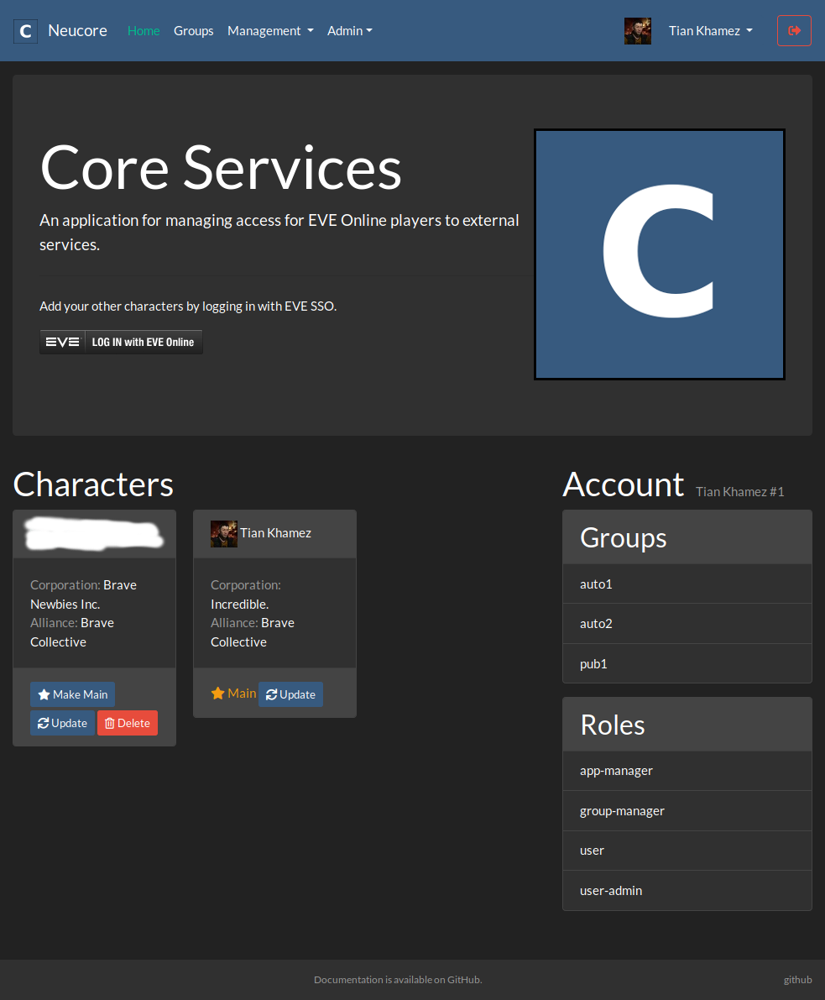
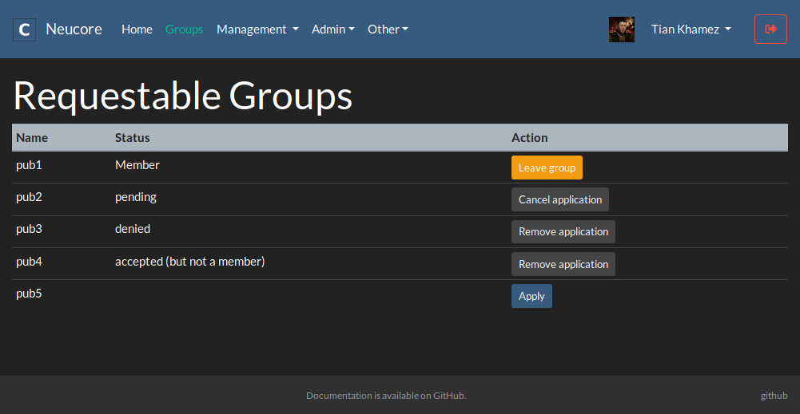
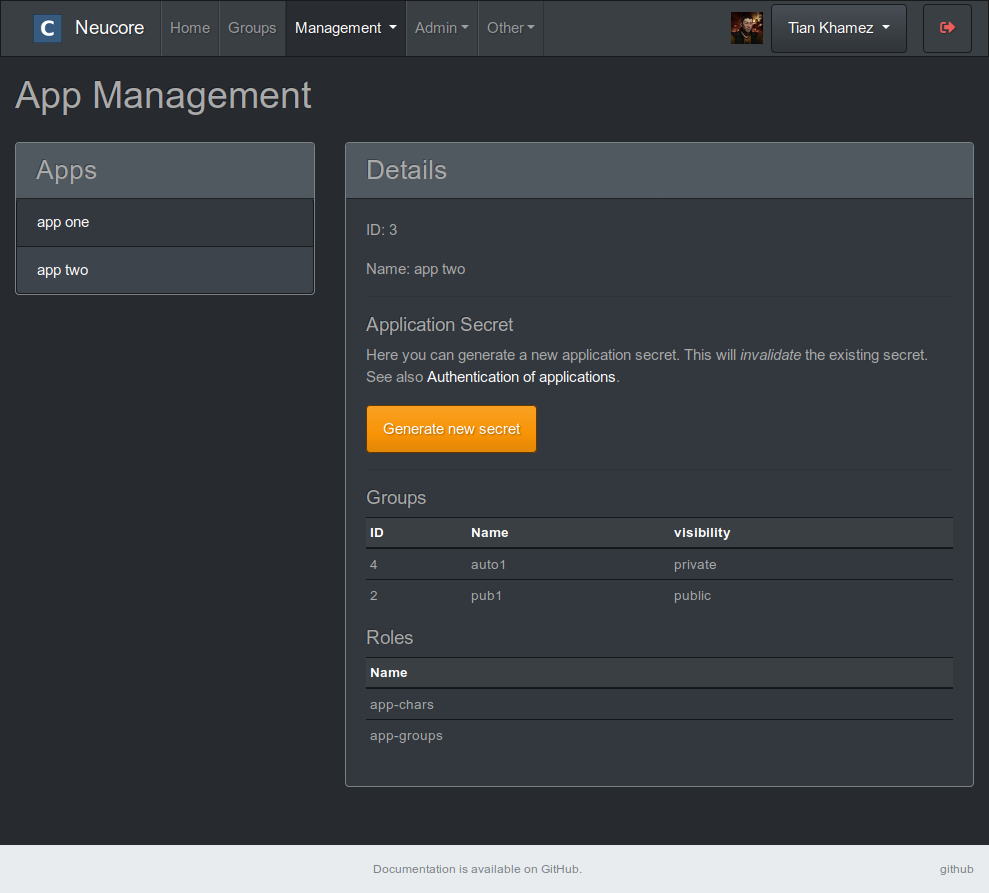
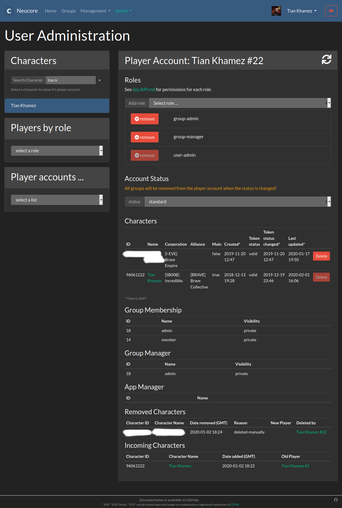
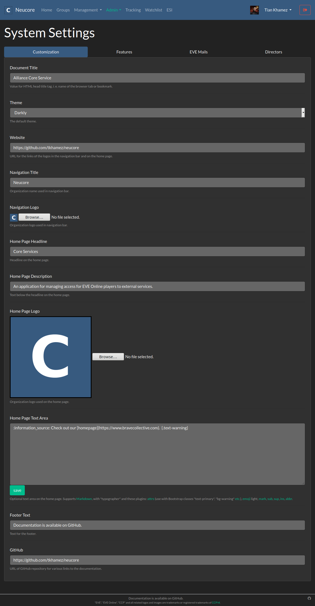
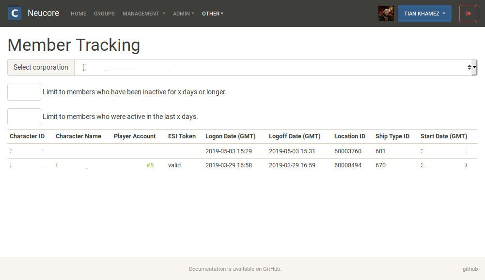
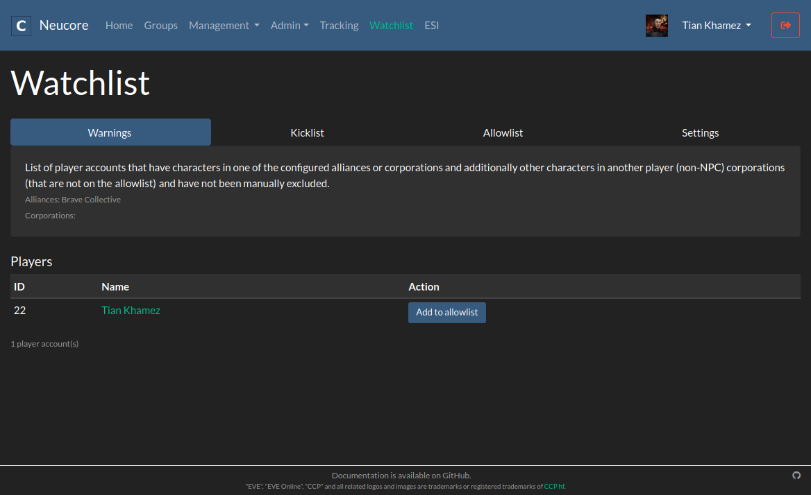
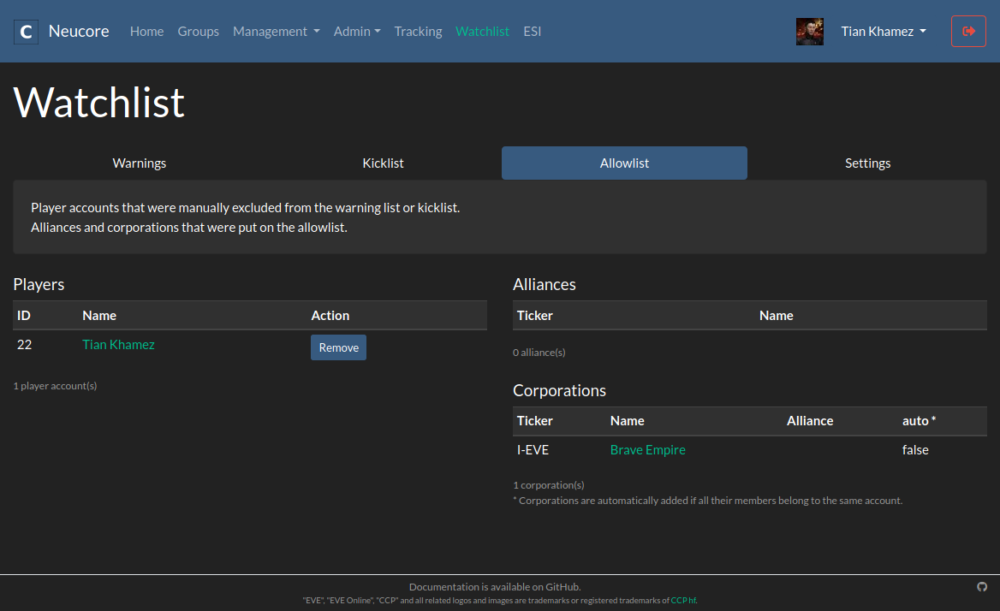

#### Home

#### Requestable Groups

#### Group Management, Members

#### Group Management, Applications - Theme Slate

#### App Management - Theme Slate

#### Group Admin, Members

#### Group Admin, Alliances - Theme Flatly

#### User Admin

#### System Settings

#### Member Tracking - Theme Sandstorm

#### Watchlist

#### Watchlist, Allowlist

